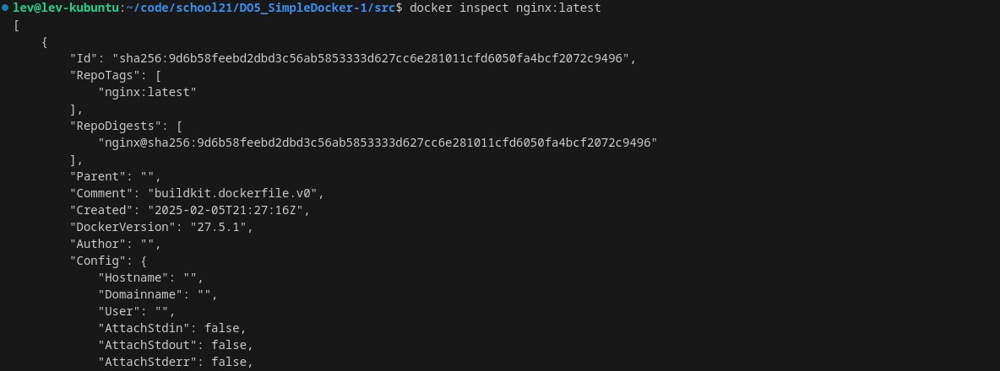

## Simple docker

## Part 1. Готовый докер

- Возьми официальный докер-образ с nginx и выкачай его при помощи docker pull.

- Проверь наличие докер-образа через docker images.

- Запусти докер-образ через docker run -d [image_id|repository].

- Проверь, что образ запустился через docker ps.

- Посмотри информацию о контейнере через docker inspect [container_id|container_name].

- По выводу команды определи и помести в отчёт размер контейнера, список замапленных портов и ip контейнера.

- Размер - "Size": 72195292
- список замапленных портов:

- IP-адрес:

- Останови докер контейнер через docker stop [container_id|container_name].
- Проверь, что контейнер остановился через docker ps.

- Запусти докер с портами 80 и 443 в контейнере, замапленными на такие же порты на локальной машине, через команду run.

- Проверь, что в браузере по адресу localhost:80 доступна стартовая страница nginx.

- Перезапусти докер контейнер через docker restart [container_id|container_name].
- Проверь любым способом, что контейнер запустился.

## Part 2. Операции с контейнером

- Прочитай конфигурационный файл nginx.conf внутри докер контейнера через команду exec.

- Включаем bash:

- Читаем:

- Создай на локальной машине файл nginx.conf.
- lev@lev-kubuntu:~/code/school21/DO5_SimpleDocker-1/src/part2$ touch nginx.conf

- Настрой в нем по пути /status отдачу страницы статуса сервера nginx.

- Скопируй созданный файл nginx.conf внутрь докер-образа через команду docker cp.

- Перезапусти nginx внутри докер-образа через команду exec.
- docker exec f3e6b74dc09e nginx -s reload

- Проверь, что по адресу localhost:80/status отдается страничка со статусом сервера nginx.

- Экспортируй контейнер в файл container.tar через команду export.

- Останови контейнер.

- Удали образ через docker rmi [image_id|repository], не удаляя перед этим контейнеры.

- Удали остановленный контейнер.
- На скриншоте сверху была надпись: image is being used by stopped container 7015c2f0e5d3. Значит, искомый контейнер - 7015c2f0e5d3.
- docker rm 7015c2f0e5d3

- Импортируй контейнер обратно через команду import.

- Запусти импортированный контейнер.

- docker run -d -p 80:80 -p 443:443 my_nginx nginx

- Проверь, что по адресу localhost:80/status отдается страничка со статусом сервера nginx.

## Part 3. Мини веб-сервер

- Программа написана в папке сервер.
- Для дальнейшей работы нужно установить в контейнере с nginx необходимые программы.
- apt-get update && apt-get install -y libfcgi-dev gcc spawn-fcgi
- После этого нужно перекинуть скомпилированный сервер (или скомпилировать его в контейнере) в директорию home, а также скинуть файл с конфигурацией nginx в /etc/nginx/
- В контейнере: root@c494ccb3603b:/home# spawn-fcgi -p 8080 -n server
- Перенаправление с 81 порта на 80 также осуществляется.

## Part 4. Свой докер

- sudo docker build -t liquorib:s21 .
- sudo docker images
- если есть проблемы со стартом из-за занятости порта, то смотрим приложения, занимающие его: sudo lsof -i:80
- sudo fuser -k 80/tcp - убиваем их процессы
- sudo docker run -it -p 80:81 -v "$(pwd)/nginx.conf:/etc/nginx/nginx.conf" -d liquorib:s21

## Part 5. Dockle

- Установка Dockle - скрипт в папке.
- Вывод после команды sudo dockle -ak NGINX_GPGKEY -i CIS-DI-0010 liquorib:s21 - чтобы проигнорировать false positive от докла насчет nginx

- Вывод после внесения изменений:

- Оставшиеся уведомления не являются ошибками(FATAL) и предупреждениями(WARN).

## Part 6. Базовый Docker Compose

- sudo docker stop $(sudo docker ps -aq) - остановить все контейнеры
- sudo docker compose up
- sudo docker rm -f $(sudo docker ps -a -q) - удалить все контейнеры
- sudo docker image remove -f $(sudo docker images -a -q) - удалить все образы